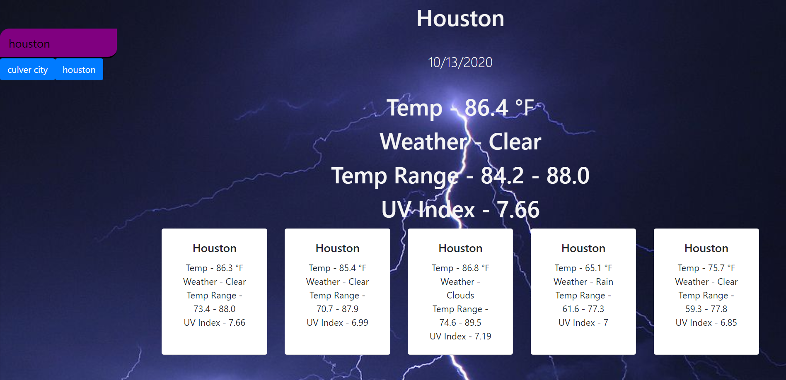

# Weather Dashboard

## Concept
This server side web application runs in the browser and features dynamically updated HTML and CSS. API calls were used to retrieve weather data for citites input by the user and returned a 5 day weather forecast. Local Storage was also used to store user inputs.

## Source

[OpenWeather API](https://openweathermap.org/api) to retrieve weather data for cities. 

## Usage

The user is able to see a 5 day weather forecast for the city they input into the app so they can plan accordingly.

## Technologies Used
HTML, CSS, JavaScript, Open Weather API, Local Storage

## Image of Deployed App

## Deployed App Link

https://anissa1908.github.io/Weather-Dashboard/

